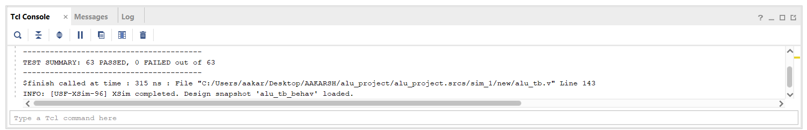
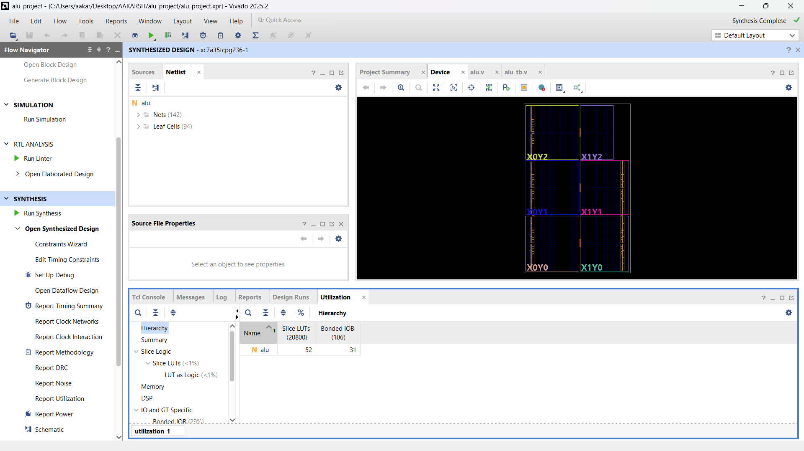
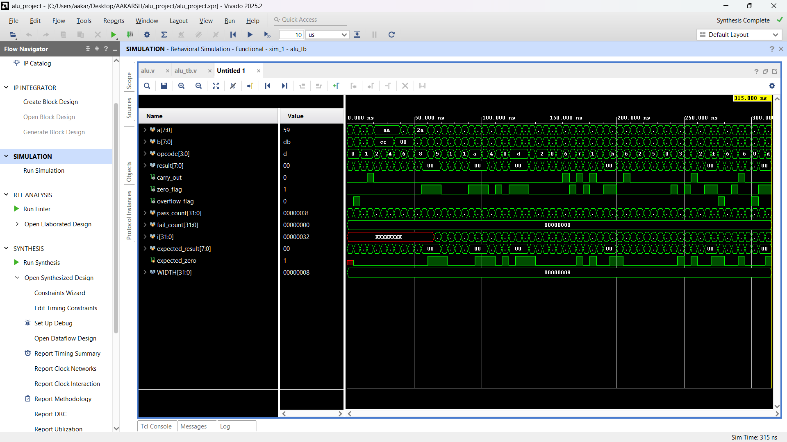

# 8-bit ALU — Verilog

Parameterized 8-bit Arithmetic Logic Unit designed in Verilog, verified with a self-checking, randomized testbench. Synthesized and simulated in Xilinx Vivado, targeting the Artix-7 (xc7a35tcpg236-1).

## Features
- Parameterized data width (default 8-bit, easily scalable)
- 8 operations via 4-bit opcode:

| Opcode | Operation |
|--------|-----------|
| 0000   | ADD       |
| 0001   | SUB       |
| 0010   | AND       |
| 0011   | OR        |
| 0100   | XOR       |
| 0101   | NOT       |
| 0110   | Shift Left (SHL) |
| 0111   | Shift Right (SHR) |
| 1000   | Compare (CMP) |

- Flag outputs: `carry_out`, `zero_flag`, `overflow_flag` (signed overflow detection on ADD/SUB)
- Purely combinational design (no clock, output is a direct function of inputs)

## Verification
Verified using a self-checking testbench with an independent reference model — the testbench computes expected outputs separately from the DUT and automatically flags mismatches, rather than relying on manual waveform inspection.

- 13 directed edge-case tests (overflow, underflow, zero-flag, compare equal/not-equal)
- 50 randomized test vectors
- **Result: 63/63 tests passed**

## Synthesis Results (Artix-7, xc7a35tcpg236-1)
| Resource | Used | Available | Utilization |
|----------|------|-----------|--------------|
| Slice LUTs | 52 | 20800 | <1% |
| Bonded IOB | 31 | 106 | 29% |
| Flip-Flops | 0 | — | — (purely combinational) |

## Waveform

## Tools
- Xilinx Vivado 2025.2 (WebPACK, free)
- Verilog HDL
- Target device: Artix-7 (xc7a35tcpg236-1)

## Files
- `alu.v` — ALU RTL design
- `alu_tb.v` — Self-checking testbench with randomized regression
